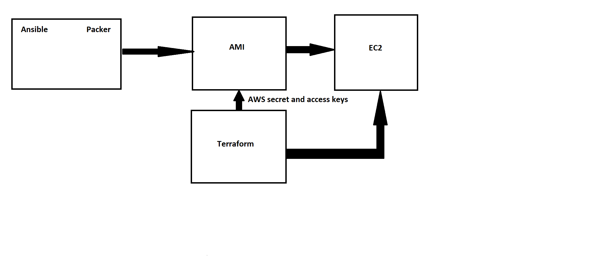

# Packer
- Packer is used to automatically create a machine image which can then be deployed later on.

## Syntax for packer
- The first lines of code are responsible for setting variables and in our case these were the aws access and secret keys which were set up as environment variables
- Next we have the "builders" which are responsible for creating the AMI's with specified values for access and secret keys, region, filters, instance type, ssh username and ami username.
- Lastly, provisioners are required to tell packer how to provision this AMI. In this case, we use an ansible playbook.
- The packer file can be validated with ```packer validate <packer_file_name>```
- It can then be built using ```packer build <packer_file_name>```


```
{
  "variables": {
    "aws_access_key": "{{ env `AWS_ACCESS_KEY` }}",
    "aws_secret_key": "{{ env `AWS_SECRET_KEY` }}"
  },
  "builders": [
    {
      "type": "amazon-ebs",
      "access_key": "{{user `aws_access_key`}}",
      "secret_key": "{{user `aws_secret_key`}}",
      "region": "eu-west-1",
      "source_ami_filter": {
        "filters": {
          "virtualization-type": "hvm",
          "name": "ubuntu/images/*ubuntu-bionic-18.04-amd64-server-*",
          "root-device-type": "ebs"
        },
        "owners": ["099720109477"],
        "most_recent": true
      },
      "instance_type": "t2.micro",
      "ssh_username": "ubuntu",
      "ami_name": "eng74-ben-packer-app-4"
    }
  ],
  "provisioners": [
    {
      "type": "ansible",
      "playbook_file": "/home/ubuntu/playbooks/playbook_app_packer.yaml"
    }
  ]
}
```

# Terraform
- Terraform is an IAC orchestration tool which allows you to create IAC for deployment on any cloud
- Terraform means "transform the Earth"
- It is a Hashicorp product



## Why Terraform
- It helps you scale up and down as per the user demand
- Allows us to be cloud independant
- Language used is HCL is similar to JSON in terms of Syntax

### Best Use Cases
- It makes us cloud independent - works with AWS-Azure-GCP

**Other IAC tools**
- Orchestration with Terraform
- from an AMI to EC2 with customised configuration

## Setting up terraform
1) Navigate to https://learn.hashicorp.com/tutorials/terraform/install-cli?in=terraform/aws-get-started and follow the instructions for your OS
2) Download the terraform zip file and extract it
3) Type env in the windows search bar then select path --> edit --> new --> browse then, navigate to the folder location for your extracted terraform and click okay.
4) Restart bash
5) Verify installation by using ```terraform -help```
6) Initialise terraform folder with ```terraform init```

## Setting up main.tf file
1) The provider is specified as "aws" with the region that the instance will be run in.
2) A resource is then declared to create an ec2 instance for our app. Within the resource the ami id, instance type, associate public ip address, name and key name specified
3) Similarly to step 2, a second resource is declared to create another ec2 instance for our db with the same variables specified.
4)```terraform plan``` is run in the terminal to verify that the main.tf file contains no errors
5) Once verified, ```terraform apply``` is run in the terminal to create the ec2 instances.
 
```
# Which Cloud Provider is required
# - AWS as we have our AMI's on AWS

provider "aws" {
        region = var.region
}

resource "aws_instance" "nodejs_instance"{
        ami = var.ami_app
        instance_type = var.instance
        associate_public_ip_address = true
        tags = {
            Name = "ben_eng74_nodeapp_version_2"
        }
        key_name = var.key_name
}

resource "aws_instance" "nodejs_db_instance"{
        ami = var.ami_db
        instance_type = var.instance
        associate_public_ip_address = true
        tags = {
            Name = "ben_eng74_nodeapp_db"
        }
        key_name = var.key_name
}
```

## Using Variables
- In order to use variables we utilise another file called ```variables.tf```
- The code below shows the syntax for creating variables in a variables.tf file
- Inside the main.tf file these variables are called by writing ```var.<variable_name>```


```
variable "region" {
     default = "eu-west-1"
}

variable "instance" {
     default = "t2.micro"
}

variable "ami_app" {
     default = "<ami_app_id>"
}

variable "ami_db" {
     default = "<ami_db_id>"
}

variable "key_name" {
     default = "<aws_ssh_key>"
```
